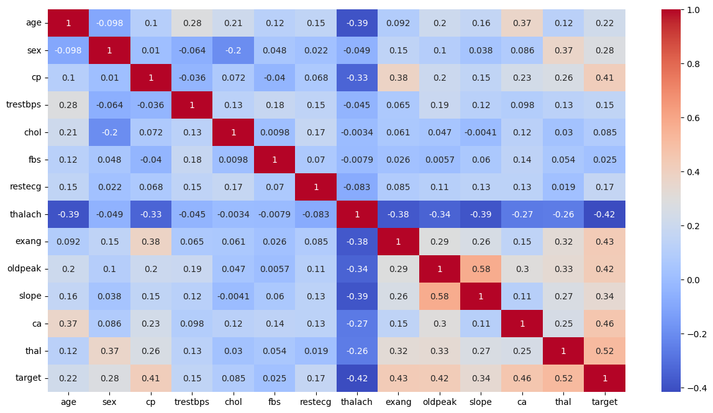
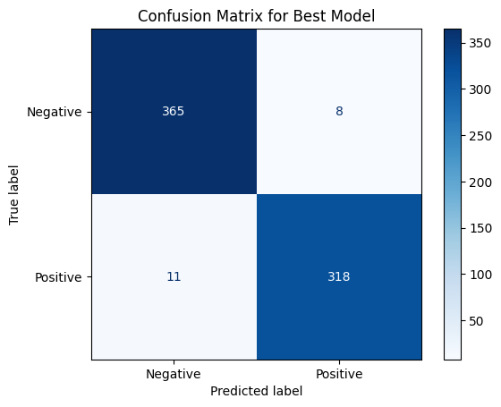
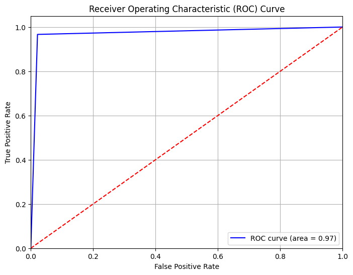
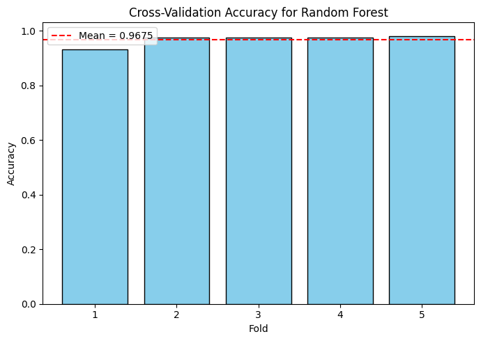

# ❤️ Heart Disease Prediction  

This project is part of **GSSoC (GirlScript Summer of Code)** and aims to build predictive machine learning models for **heart disease detection** using the **Cleveland Heart Disease Dataset (UCI Repository)**.  

---

## 📂 Dataset Description  

- **Source**: Cleveland Heart Disease dataset (UCI Machine Learning Repository, dataset #303).  
- **Target Variable**: Binary classification  
  - `0` → Healthy  
  - `1` → Heart Disease  

### 🔑 Features:  
- **Demographics**: `age`, `sex`  
- **Clinical measurements**: `trestbps` (resting blood pressure), `chol` (cholesterol), `thalach` (maximum heart rate)  
- **Exercise-related**: `oldpeak` (ST depression), `exang` (exercise-induced angina)  

### ⚖️ Class Distribution (Before Balancing):  
- Healthy → **164 (54%)**  
- Heart Disease → **139 (46%)**  

---

## 📊 Balanced vs Imbalanced Dataset Distribution  

### 🔹 Data Preprocessing  

- **Feature Normalization** → Used `MinMaxScaler` to scale features into `[0,1]` range.  
- **Class Imbalance Mitigation** → Applied **SMOTE (Synthetic Minority Oversampling Technique)** + **Random Undersampling**.  
  - Final dataset: **1753 samples per class (3506 total)**.  

### ✨ Feature Selection  
- Used **correlation-based feature selection** (threshold = `0.3`).  
- Selected **10 critical features** for training.  

📊 **Correlation Heatmap**  
  

---

## 🤖 Model Development  

Three ML models were implemented *(default hyperparameters unless specified)*:  

1. **Support Vector Classifier (SVC)** – RBF kernel  
2. **Random Forest (RF)** – 100 decision trees, Gini impurity  
3. **XGBoost** – Gradient boosting with learning rate η = 0.3  

---

## 📊 Model Evaluation  

### 🔹 Performance (Without Balancing)  

| Model                           | Accuracy |
|--------------------------------|----------|
| Support Vector Classifier (SVC) | 0.8689   |
| Random Forest                   | 0.8525   |
| XGBoost                         | 0.8033   |

---

### 🔹 Performance (After Balancing)  

| Model                           | Train Accuracy | Test Accuracy |
|--------------------------------|----------------|---------------|
| Support Vector Classifier (SVC) | 0.9058         | 0.9060        |
| Random Forest                   | 1.0000         | 0.9687        |
| XGBoost                         | 0.9996         | 0.9729        |

✅ **Best Model: XGBoost** → Test Accuracy = **97.29%**  
✅ **ROC AUC Score** = **0.9726**  

---

## 🔹 Confusion Matrix  

📊 Confusion Matrix (Best Model - XGBoost)  

  

---

## 🔹 ROC Curve  

📊 ROC Curve  

  

---

## 🔹 Cross-Validation  

📊 Cross-Validation Results (5-Fold)  

  

- Used **5-fold cross-validation**  
- **Random Forest** achieved **94.87% mean accuracy**  

---

## 🙌 Contribution  

This project is contributed under **GSSoC**.  
Feel free to **fork the repo**, raise **issues**, and create **PRs**! 🚀  

---
